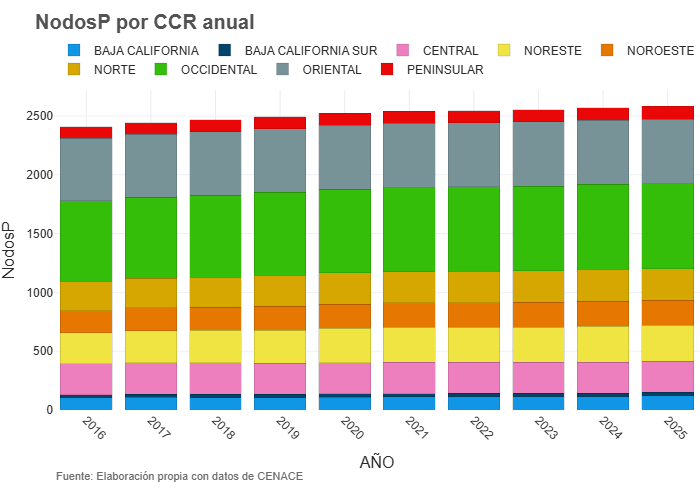
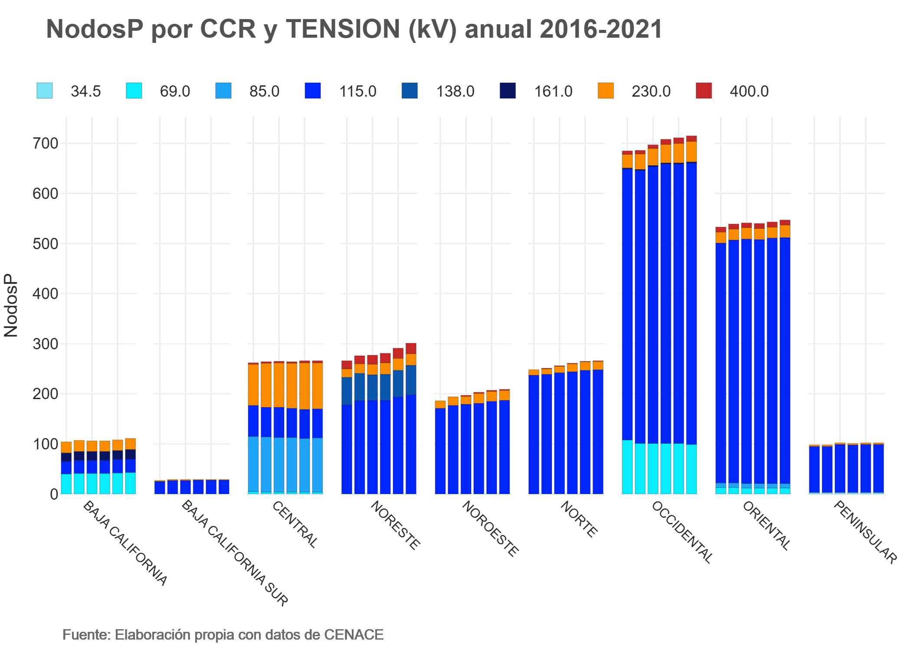

# Introducción
Los NodosP son puntos físicos de inyección y retiro de energía eléctrica en la red nacional, en ellos se calcula el precio de la energía para las liquidaciones en el Mercado Eléctrico Mayorista (MEM). El CENANCE reporta el catálogo de NodosP activos en el sitio del Sistema de Información del Mercado, donde se pueden consultar en formato .xlsx con una periodicidad mensual (https://www.cenace.gob.mx/Paginas/SIM/NodosP.aspx).

En este análisis se extraen, transforman y analizan los datos de los catálogos de NodosP publicados por el CENACE desde diciembre de 2016 hasta diciembre de 2025. Se cuantifica el número de NodosP que estuvieron activos cada año, en cada CCR y por nivel de tensión para tener un panorama de como ha cambiado la distribución de NodosP en este periodo de tiempo. Además, se analiza la ubicación de estos NodosP en el mapa y como esto se relaciona con la instalación de centrales de generación eléctrica o la presencia de industrias con alto consumo de electricidad. 

### Resultados 
El número de NodosP activos cada año pasó de 2409 en 2016 a 2585 en 2025, lo que representó un aumento del 7%. El porcentaje de NodosP en cada CCR respecto al total de NodosP del SEN se mantuvo constante en el periodo analizado, como se observa en la Figura 1. En 2025, el CCR Occidental tuvo la mayor cantidad de NodosP, 723 que representan el 28% del total del SEN, mientras que el CCR Baja California Sur tuvo solo 31 NodosP que equivalen al 1.2% del total. 

En el periodo analizado, los CCR en los que se han añadido mayor cantidad de NodosP son el Noreste con 41 y el Occidental con 38. Por otra parte, el CCR Central no tuvo ninguna adición de NodosP en este periodo, y en el CCR Oriental se añadieron solamente 13 NodosP, lo que es una cantidad limitada para ser el segundo CCR con más nodos en el SEN. Por otro lado, los CCR de Baja California Sur, Baja California, Peninsular, Noroeste y Norte tuvieron un aumento de 4, 16, 15, 28 y 21 NodosP, respectivamente. Este cambio en la cantidad de NodosP en cada CCR sugiere que ha habido mayor crecimiento en infraestructura del sistema eléctrico en los CCR Noreste y Occidental, mientras que el CCR Central no ha tenido desarrollo de infraestructura.
Sin embargo, no solamente se trata de la cantidad de NodosP por CCR, también es interesante analizar el nivel de tensión de los NodosP. En 2025, los NodosP de 115 kV fueron los que conforman la mayoría del SEN con 1927 NodosP, lo que equivale al 74.5%, esto se muestra en la Figura 2, y se aprecia que el porcentaje de NodosP de cada nivel de tensión en el periodo analizado se ha mantenido con pocos cambios.

Se analizó el cambio en número de NodosP en cada CCR y de cada nivel de tensión (Figura 3), así como la ubicación de NodosP por municipio (Figuras 5-10). El mayor número de NodosP de 400 kV se encuentra en el CCR Noreste, en el que el número de NodosP aumentó de 16 en 2016 a 21 en 2025. Se puede observar en la Figura 4 que la zona con mayor densidad de NodosP de 400kV es en los municipios de la zona metropolitana de Monterrey, con 7 NodosP. Por otra parte, la mayor cantidad de NodosP de 230 kV se ubicó en el CCR Central, que aumentó de 82 en 2016 a 95 en 2025. Como se puede ver en la Figura 5, las zonas de mayor concentración de NodosP de 230 kV son la Ciudad de México con un total de 35 NodosP considerando todas las alcaldías, el municipio de Mexicali, Baja California, con 16 NodosP, y el municipio de Ecatepec con 9. Los NodosP de 161 kV solamente se ubican en los CCR Occidental y de Baja California, en 2025 hubo 24 NodosP activos, de los cuales 20 se concentran en el municipio de Mexicali. Todos los NodosP de 138 kV se ubican en el CCR Noreste, particularmente en la frontera de los estados de Coahuila y Tamaulipas con EE.UU. como se observa en la Figura 6. El municipio con mayor cantidad de NodosP de 138 kV es Reynosa, Tamaulipas con 23. Los NodosP de 115 kV son los más abundantes en el SEN, se encuentran distribuidos por todo el territorio como se mira en la Figura 7. Sin embargo, el mayor número de NodosP de 115 kV se ubican en el CCR Occidental, sumando 546. Los municipios con mayor cantidad de estos NodosP son Villa Hidalgo, San Luis Potosí y Hermosillo, Sonora, ambos con 51 NodosP. Los NodosP de 85 kV solo se ubican en los CCR Central y Oriental, en 2025 estuvieron activos un total de 100 NodosP de este nivel de voltaje. La zona metropolitana del valle de México concentra la mayoría de estos NodosP, como se ve en la Figura 9. El municipio con mayor cantidad de NodosP de 85 kV es Toluca, Estado de México, con 10, seguido de Cuautitlán y Tlalnepantla de Baz, con 9 NodosP cada uno. En 2025 estuvieron activos un total de 149 NodosP de 69 kV, de los cuales la mayoría se ubican en los CCR Occidental y Baja California, con 91 y 44 NodosP, respectivamente. Como se ve en la Figura 10, el municipio de Tijuana, Baja California, tiene la mayor densidad de NodosP de 69 kV, con 35, mientras que en los municipios de la zona metropolitana de Guadalajara se concentran un total de 63 NodosP. Finalmente, entre 2016 y 2025 solo estuvieron activos 3 NodosP de 34.5 kV, ubicados en el CCR Peninsular, particularmente en el municipio de Cozumel, Quintana Roo.

